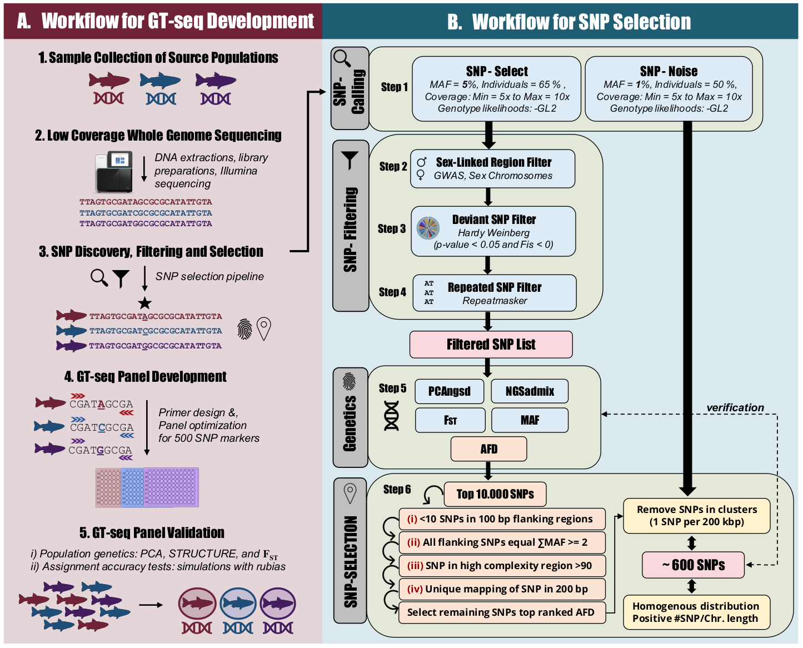

# GTseq scripts

Scripts used in step 6 "SNP selection" of the Beemelman et al. paper (see
Reference section) to design GTseq panels for three salmonid species

# TODO

- Add sample files to test scripts?
    - See: `/media/data/Projects/Anne_Beemelmans/2023-12-07_design_GTseq_panel_arctic_charr_taloyoak`
- Add bash commands for test
- Add reference to article once available (bioRxiv?)

## Overall pipeline

Click on the following schema of the pipeline to see a larger version



## Description of scripts

### Compute pairwise AFD values

Starting from MAF values in each group, compute all pairwise AFD values.

Script: `01_compute_pairwise_AFDs.py`

```
Compute and report all pairwise AFDs based on MAFs

Usage:
    <program> input_mafs output_afds

Examples input format (number of columns dependents on the number of groups):

ChromName	pos	maf1	maf2	maf3
Chr1		33	0.07	0.14	0.30
Chr2		98	0.61	0.22	0.18
```

### Subset SNPs to keep only these with high AFDs

Keep only SNPs for which the maximum pairwize AFD value is above a given
threshold.

Script: `02_pre_filter_SNPs_on_pairwise_AFDs.py`

```Report SNPs whith a maximum pairwise AFD value above user theshold

Usage:
    <program> input_afds min_afd output_ids

Examples input format (number of columns dependents on the number of pairwise tests):

ChromName	pos	afd1	afd2	afd3
Chr1		33	0.07	0.14	0.30
Chr2		98	0.61	0.22	0.18
```

### Extract information about potential SNPs

Script: `03_score_SNPs_for_GTseq.py`

```
For each SNP of interest, extract information about flanking SNPs, sequence
complexity and GC content, etc.

Usage:
    <program> input_selected_snps input_all_snps input_genome window_size output_file

`input_selected_snps` file format:

NC_036838.1	60649
NC_036838.1	84727
NC_036838.1	434621
NC_036838.1	981627
NC_036838.1	1702986
NC_036838.1	1758963
NC_036838.1	1761652

`input_all_snps` format:

chromo       position  major  minor  anc  knownEM   nInd
NC_036838.1  25        G      A      G    0.010773  138
NC_036838.1  29        G      T      G    0.844871  139
NC_036838.1  53        A      C      A    0.036794  156
NC_036838.1  67        C      T      C    0.011812  174
NC_036838.1  86        G      A      G    0.161940  178
NC_036838.1  88        T      G      T    0.022172  174

`input_genome` format: fasta or gzip-compressed fasta

`window_size`: Minimum distance between two retained SNPs <int>

`output_file`: Name of output file
```

### Filter SNPs based on extracted information

Script: `04_filter_SNPs.R`

```
Apply filters to SNPs based on flanking SNPs and sequence properties
```

### Select best panel to maximize group differentiation

Script: `05_select_best_SNPs_pairwise.py`

```
Choose the best SNPs for all pairs of populations

For each pair of populations
    - sort the AFDs by decreasing order
    - Pick the top ones (exclude them if they are within `min_distance` of a previously retained SNPs)
    - Go down the list until you have reached `target_sum` of AFDs <float>

Continue for following populations and report retained SNPs

Usage:
    <program> input_afds target_sum exponent min_distance output_snps

Format of input_afds file (tab-separated):

ChromName    Position  AFDScore  AFDScore  AFDScore  AFDScore  AFDScore  AFDScore  AFDScore
NC_036838.1  1743435   0.171305  0.272733  0.115156  0.056149  0.387889  0.444038  0.014845
NC_036838.1  1760446   0.182961  0.384065  0.077204  0.105757  0.306861  0.201104  0.350584
NC_036838.1  1902438   0.03789   0.048098  0.122343  0.160233  0.170441  0.010208  0.319688
NC_036838.1  1926887   0.187807  0.031834  0.06648   0.254287  0.034646  0.219641  0.386849
NC_036838.1  1942787   0.155984  0.147081  0.02978   0.185764  0.117301  0.303065  0.263861
NC_036838.1  1949218   0.200558  0.065416  0.034061  0.166497  0.099477  0.265974  0.368012
NC_036838.1  2009390   0.106727  0.03674   0.379363  0.272636  0.342623  0.069987  0.205130
NC_036838.1  2171262   0.194908  0.427275  0.248636  0.053728  0.178639  0.232367  0.203546
NC_036838.1  3253985   0.144088  0.479436  0.307792  0.163704  0.171644  0.335348  0.023561
```

## Reference

## License

CC share-alike

<a rel="license" href="http://creativecommons.org/licenses/by-sa/4.0/"></a><br /><span xmlns:dct="http://purl.org/dc/terms/" property="dct:title">gtseq_scripts</span> by <span xmlns:cc="http://creativecommons.org/ns#" property="cc:attributionName">Eric Normandeau</span> is licensed under a <a rel="license" href="http://creativecommons.org/licenses/by-sa/4.0/">Creative Commons Attribution-ShareAlike 4.0 International License</a>.
