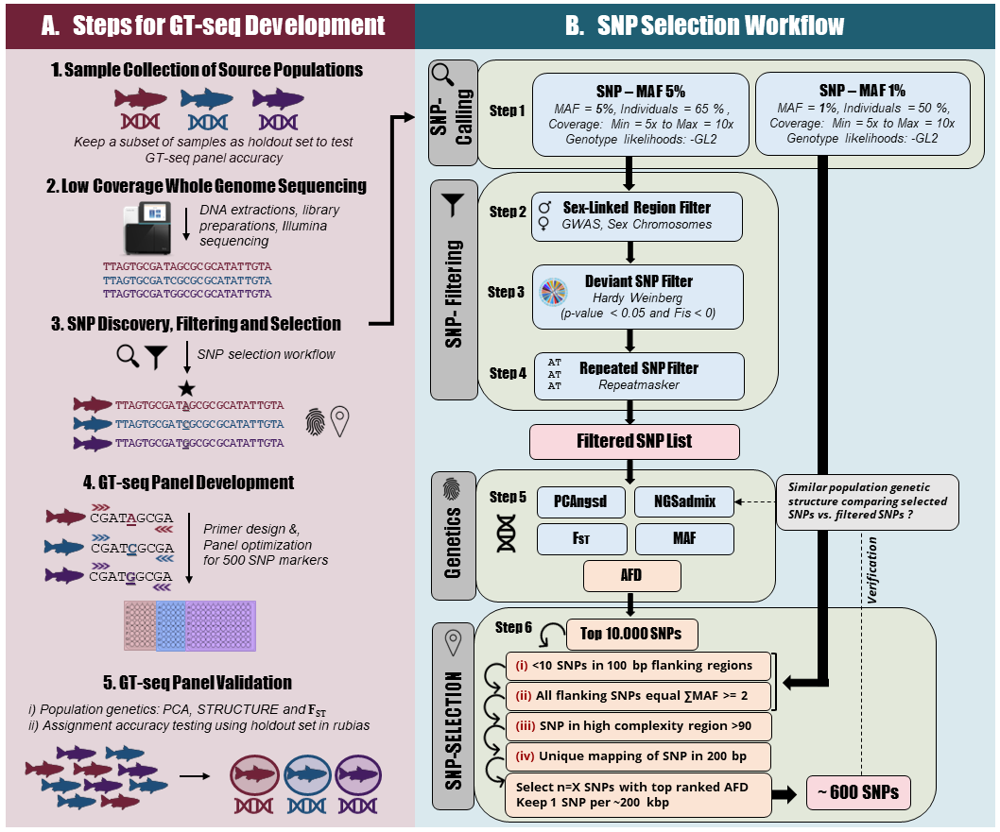

# GTseq scripts

Scripts used in step 6, "SNP selection", of the Beemelmanns paper cited below
to design GTseq panels for three salmonid species.

## Reference

TODO: *Add reference to paper once available*

## Overall workflow

Click on the following schema of the workflow to see a larger version



## Description of scripts

Below, each script is described briefly in order of use with the commands that
can be used to run all the scripts on the test dataset found in `02_data`. The
Python scripts can be launched without arguments to print their documentation
strings. The R script should be run interactively, for example in RStudio, to
decide on the thresholds for the filters before applying them.

**/!\ WARNING:** Due to the presence of the test data, **this repository
weights about 135 MB**

### Compute pairwise AFD values

`01_compute_pairwise_AFDs.py`: Starting from MAF values in each group, compute
all pairwise AFD values.

```
./01_scripts/01_compute_pairwise_AFDs.py 02_data/mafs_chr1.tsv afds_chr1.tsv
```

### Subset SNPs to keep only these with high AFDs

`02_pre_filter_SNPs_on_pairwise_AFDs.py`: Keep only SNPs for which the maximum
pairwise AFD value is above a given threshold.

```
./01_scripts/02_pre_filter_SNPs_on_pairwise_AFDs.py afds_chr1.tsv 0.4 afds_chr1_min0.4.tsv
```

### Extract information about potential SNPs

`03_score_SNPs_for_GTseq.py`: For each SNP of interest, extract information
about flanking SNPs, sequence complexity and GC content, etc.

```
./01_scripts/03_score_SNPs_for_GTseq.py afds_chr1_min0.4.tsv 02_data/all_snps_chr1.mafs 02_data/genome_chr1.fasta 100 afds_chr1_min0.4.scored.tsv
```

### Filter SNPs based on extracted information

`04_filter_SNPs.R`: Apply filters to SNPs based on flanking SNPs and sequence
properties

```
# Run in RStudio
```

### Extract AFD information for retained SNPs

`05_extract_AFDs_wanted_SNPs.py`: From the computed pairwise AFD, keep only the
lines for the SNPs that passed the filters.

```
./01_scripts/05_extract_AFDs_wanted_SNPs.py afds_chr1.tsv afds_chr1_min0.4.scored.good.tsv afds_chr1_min0.4.scored.good.AFDs.tsv
```

### Select best panel to maximize group differentiation

`06_select_best_SNPs_pairwise.py`: Choose the best SNPs for all pairs of
     populations

```
./01_scripts/06_select_best_SNPs_pairwise.py afds_chr1_min0.4.scored.good.AFDs.tsv 12.6 2 10000 afds_chr1_min0.4.scored.good.AFDs.selected.tsv
 ```

You can use this output to visualize how the SNPs are distributed along the chromosomes.

## License

CC share-alike

<a rel="license" href="http://creativecommons.org/licenses/by-sa/4.0/"></a><br /><span xmlns:dct="http://purl.org/dc/terms/" property="dct:title">gtseq_scripts</span> by <span xmlns:cc="http://creativecommons.org/ns#" property="cc:attributionName">Eric Normandeau</span> is licensed under a <a rel="license" href="http://creativecommons.org/licenses/by-sa/4.0/">Creative Commons Attribution-ShareAlike 4.0 International License</a>.
